# SubmitAssignment
在线作业提交系统、课设作业

## 说明

### 开发环境：

- Java版本：Java 1.8
- 前端框架：LaiUI v2.6.8、Thymeleaf渲染引擎
- 后端框架：SpringBoot 2.5.2 
- 构建软件：Maven 3.8.1
- IDE：IDEA 2021
- 数据库：MySQL 8.0.25

### 亮点

使用EasyExcel可以批量导入信息

使用阿里云OSS做附件管理，节省服务器资源

## 具体功能

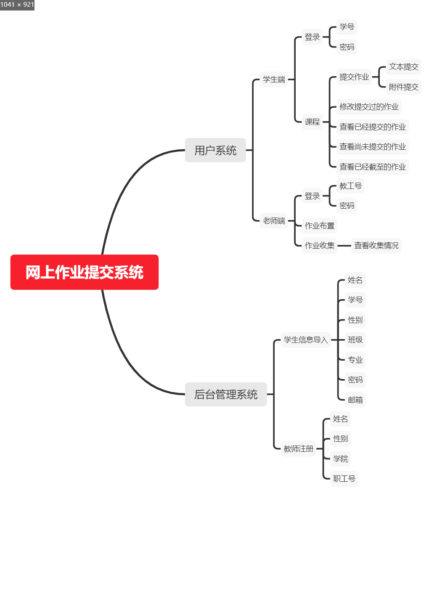

## 如何运行

1. 在IDEA中导入该项目
2. 创建一个数据库，然后执行根目录下的tyut.sql即可。
3. 修改application.yml中的配置文件

### 修改数据库配置

url 填入jdbc的链接地址，例如：jdbc:mysql://localhost:3306/tyut?serverTimezone=Asia/Shanghai

username填写自己数据库用户名

password填写对应的密码

如果是MySQL5.7版本还需修改driver-class-name为：com.mysql.jdbc.Driver

### 修改阿里云OSS对象存储数据

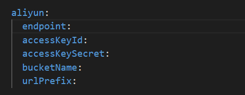

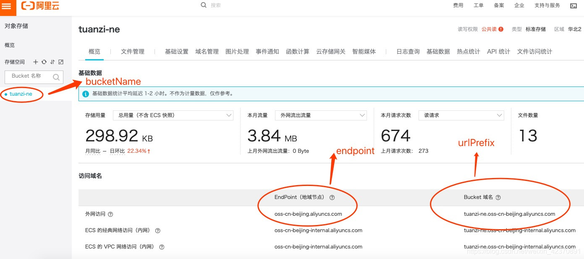

urlPrefix需要再在开头添加https://

注：关于阿里云OSS的使用可以查看[团子.的博客-CSDN博客_springboot整合oss](https://blog.csdn.net/weixin_42370891/article/details/99102508)

### 运行：

在src\main\java\edu\tyut\assignsub中找到AssignmentSubmissionApplication.java右键运行

之后可在127.0.0.1:8080中登录系统

这时可在数据库中的manager添加一条管理员信息，然后登录系统

## 一些可能用到的图片

### 数据库设计

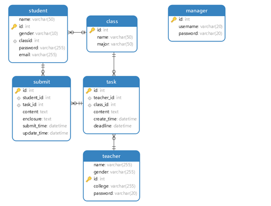

### 数据模型（ E-R图）

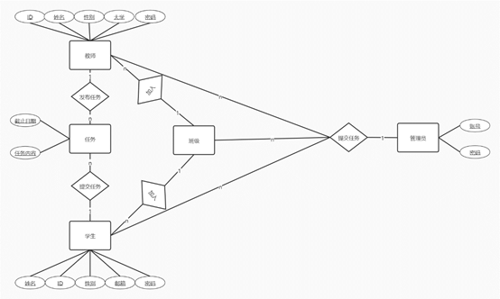

### 功能模型（数据流图）

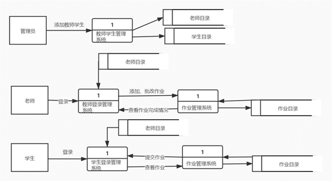

### 行为模型（状态图）

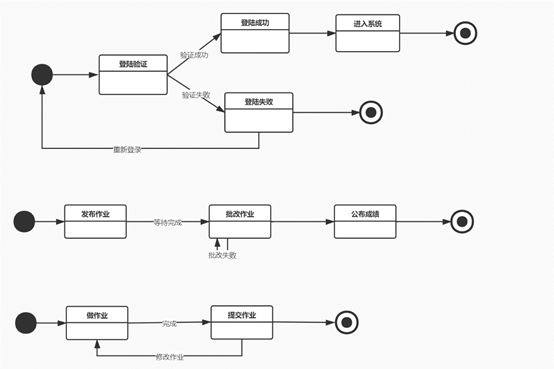

### 时序图

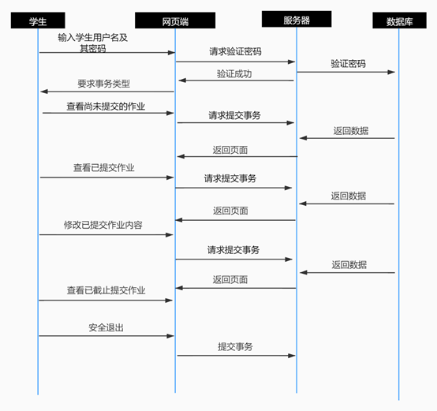

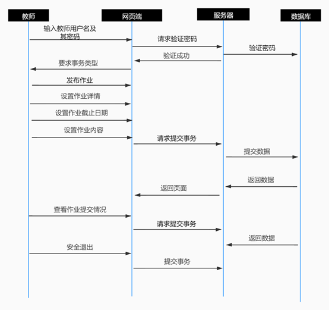

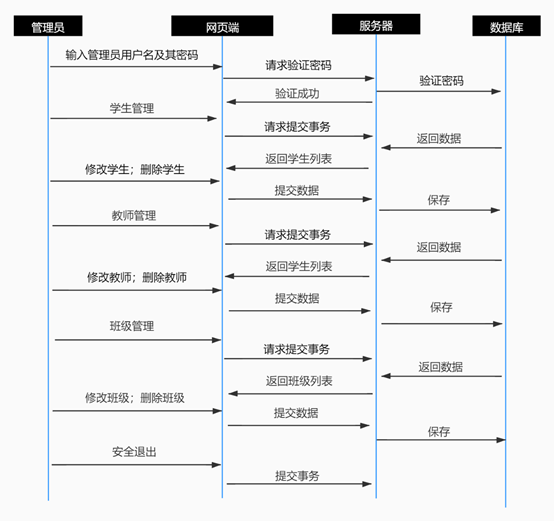

### 结构图

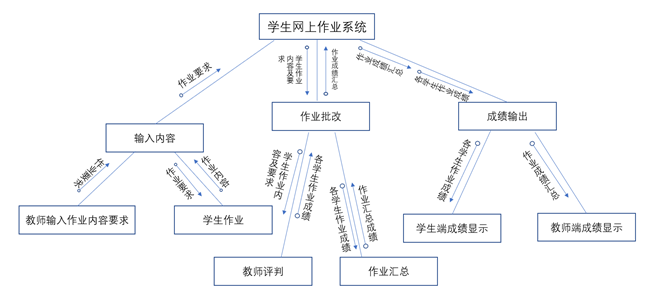
